<!-- TOC -->
# How's it Hanging

Hangman is a word guessing game. Traditionally hangman is a game played with pen and paper and two or more people. One person picks a word and lets the others guess the letters to find the correct word. For this project I created an electronic version of this game where the user plays against the computer. This was achieved using python to select a random word from a list and check if guesses are right, wrong, already guessed or invalid. My version of the game has two levels of difficulty, easy and hard. A full description of the rules and traditional version of the game can be found <a href="https://en.wikipedia.org/wiki/Hangman_(game)"> here</a>.  

## Table of Contents
<!-- TOC start -->
- [How's it Hanging](#hows-it-hanging)
  * [Flow Chart](#flow-chart)
  * [User Experience](#user-experience)
    + [Project Goals](#project-goals)
    + [User Stories](#user-stories)
    + [Coloured Text](#coloured-text)
    + [Process Flow Chart](#process-flow-chart)
    + [Game Features](#game-features)
      - [Technology Used](#technology-used)
      - [Languages Used](#languages-used)
    + [Testing](#testing)
      - [User Stories Testing](#user-stories-testing)
      - [Validation Testing](#validation-testing)
      - [Bugs:](#bugs)
        * [Fixed Bugs:](#fixed-bugs)
    + [Deployment:](#deployment)
    + [References:](#references)
    + [Acknowledgements](#acknowledgements)
<!-- TOC end -->

<a href="https://hows-ithanging.herokuapp.com/">A link to the deployed website can be found here</a>.

<!-- TOC -->
## Flow Chart
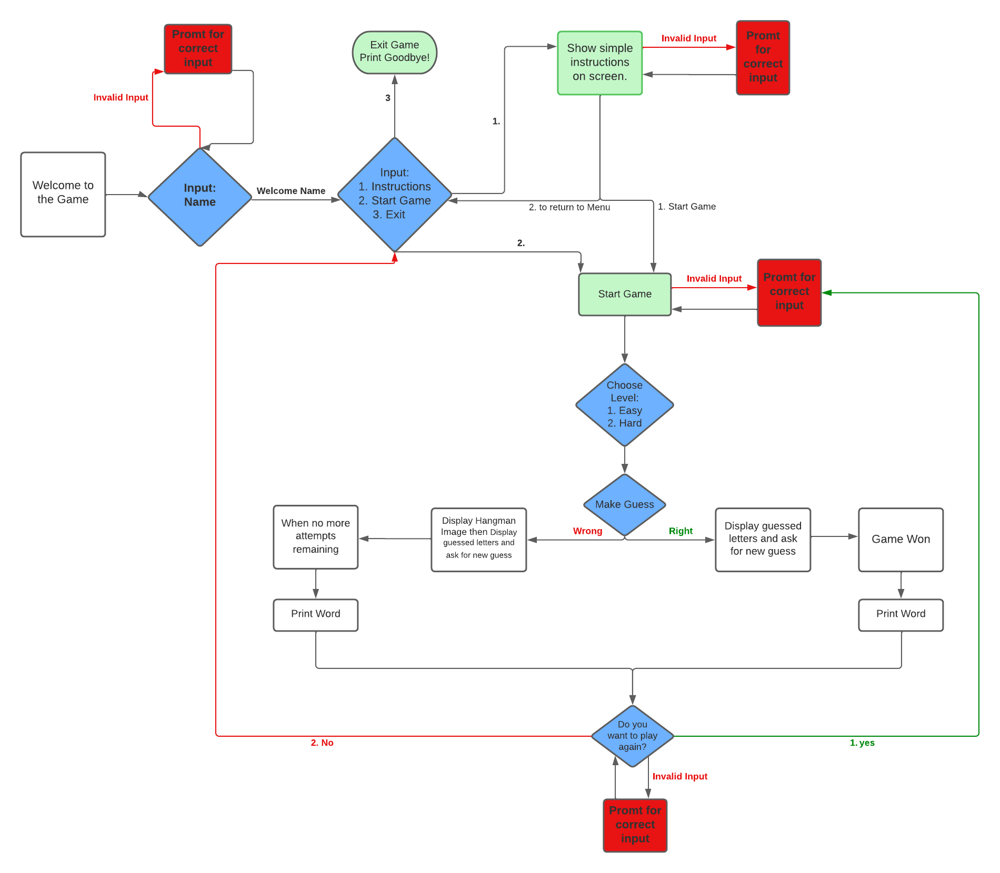
- The logic for this project was developed through the use of flow charts using the platform <a href="https://lucid.app/lucidchart/635f4e3b-525e-4ce1-a8b6-f5671a598593/edit?beaconFlowId=1FA3280D25486DE5&invitationId=inv_7f909668-620b-464a-a2c8-5221a92b20f6&page=0_0#"> Lucid Charts</a>.

<!-- TOC -->
## User Experience
<!-- TOC -->
### Project Goals
- The game is easy to navigate and user friendly.
- The game to loop and allow the player to continue to play after each game. 
- The game should have a choice of difficulty levels.
- It should be clear how many attempts are left in the game. 
- To provide the user with an easy to find instructions section to explain how the game works.

<!-- TOC -->
### User Stories
- As a player, I want the instructions to be easily accessible.
- As a player, I want the game to be user friendly.
- As a player, I want the game to be fun and engaging.
- As a player, I want there to be a selection of levels. 

<!-- TOC -->
### Coloured Text
- Throughout the design of the project I followed a flow chart and extended this logic to the visual design of the game. I decided to implement a simple colour scheme to improve the overall user experience.
    - The colour red ("\033[0;31m) was used for errors and wrong guesses. 
    - The colour cyan ("\033[0;36m) was used for input lines. 
    - The colour green ("\033[0;32m) was used for the instruction's menu and for correct guesses.

<!-- TOC -->
### Process Flow Chart
Lucid Charts was used to design the logic used in the development of this game.

<!-- TOC -->
### Game Features
Feature | Description | Example
| --- | --- | --- |
Welcome page | Welcome screen | 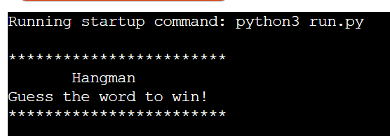 
Name | Asking for users name all characters valid to allow individuality | 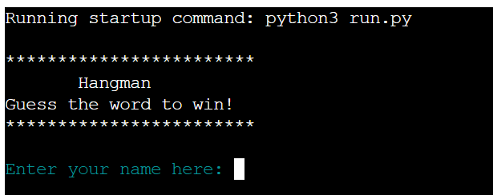 
Instructions | Simple game instuctions are shown to the user if selected | 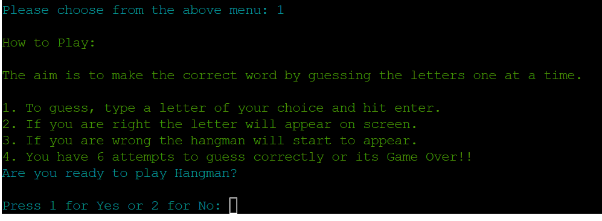 
Attempts | Screen displayed with remaining attempts this counts down with every wrong guess | 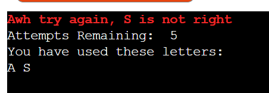
Letters Played | Display of previous guesses is shown after every turn |   
Winning Message | Screen displayed when user wins | 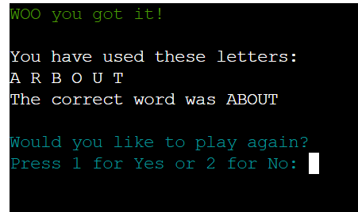 
Losing Message | Screen displayed when user loses | 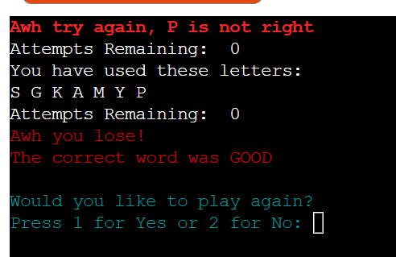 
Choice of levels | Screen displayed for choice of levels. Options are 1 for easy and 2 for hard. The choice determines how many letters will be in the word. | 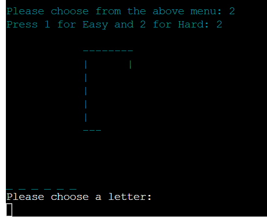 
Hangman Images | |
Play again | Screen displayed asking to play again giving the user the option to 1. go again or 2. return to the main menu| 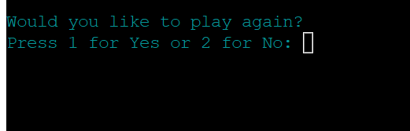 
Clear Terminal | Terminal cleared between turns to improve overall user experience | 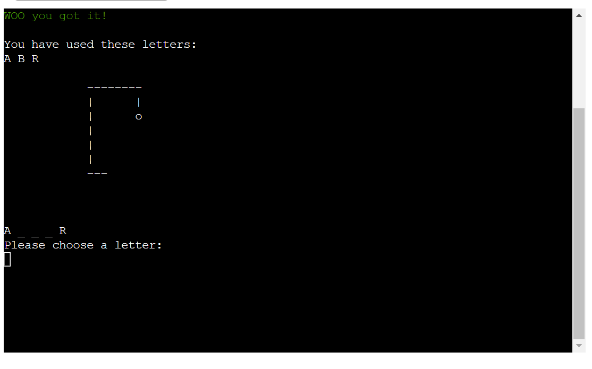 
 
<!-- TOC -->
### Future Features
- High Score Display
    - A future feature that I would like to add to the app is to display high scores. This would be achieved using a Google Spreadsheet to store the number of attempts it took, or numbers of games won for each name entered. This scoreboard could then be displayed by printing the contents to the terminal. 
- Level of Difficulty
    - Although this game provides users with the choice of playing an Easy or Hard game, I would like to add more attempts to the Easy level to further distinguish between the two levels. This would be achieved by saving the hangman images in a new file and calling the altered Easy diagrams for the Easy game or the Standard diagrams for the Hard game.

<!-- TOC -->
#### Languages Used
- <a href="https://en.wikipedia.org/wiki/Python_(programming_language)"> Python</a>

<!-- TOC -->
#### Technology Used
- <a href="https://gitpod.io/workspaces">GitPod</a> was used for writing code, committing, and then pushing to GitHub.
- <a href="https://github.com/AmyDelaney94/">Github</a> was used to store the project after pushing.
- <a href="https://lucid.app/documents#/dashboard">Lucid Charts</a> was used to create and design the flow chart used in the logical design of this project. 
- <a href="http://ami.responsivedesign.is/">Am I Responsive?</a> was used in order to see responsive design throughout the process.
- <a href="http://pep8online.com/">PEP8 online check</a> was used to validate the python code. 
- <a href="http://pep8online.com/">Heroku</a> was used to deploy the application. 
- Built-in Python Libraries
    - os -> The os library was imported to create a function to utilise the os.system to clear the terminal. This library was imported to improve the overall user experience and to ensure the terminal is clear between rounds. 

    - random -> The random library was imported to access the built-in method of generating a random word from the word.py file using the "random." method.

    - sys -> The sys library was imported to create a function that allows the user to exit the game. This was achieved using the built in sys.exit() method. 

<!-- TOC -->
### Testing

Feature | Outcome | Example | Pass
| --- | --- | --- |--- |
Name Input | Validate if field is empty | 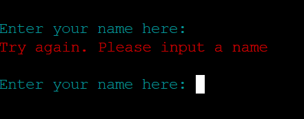 | Pass
Name Input | Validate if entry is valid | 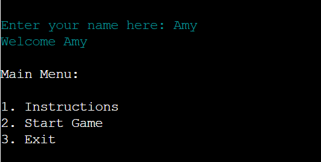 | Pass
Main menu | Validate if entry is valid - special character input |  | Pass
Main menu | Validate if entry is valid - letter input | 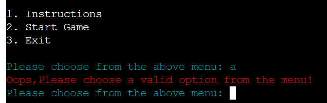 | Pass
Main menu | Validate if entry is valid - number input | 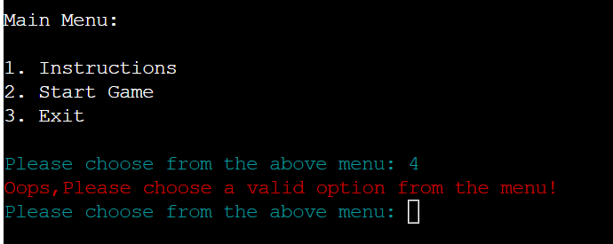 | Pass
Main menu | Validate if field is empty | 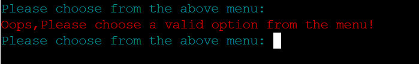 | Pass
Instructions Options | Validate if selection is valid - option 1 | 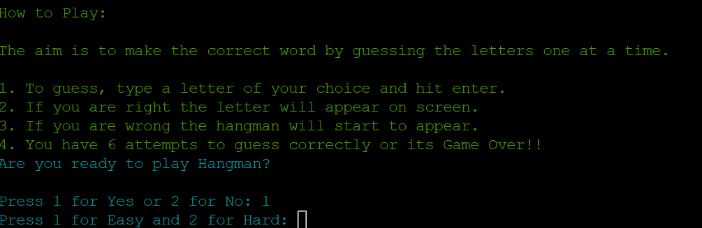 | Pass
Instructions Options | Validate if selection is valid - option 2 | 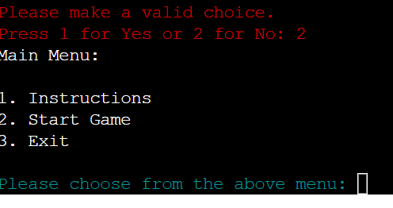 | Pass
Instructions Options | Validate if field is empty | 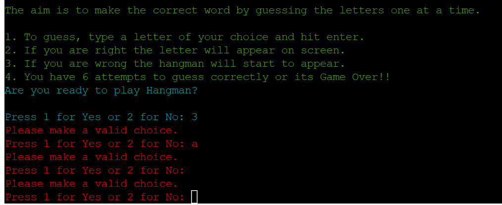 | Pass
Instructions Options | Validate if selection is valid - letter test | 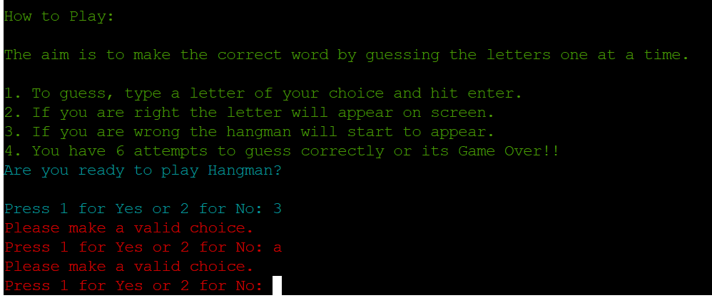 | Pass
Instructions Options | Validate if selection is valid - wrong number test | 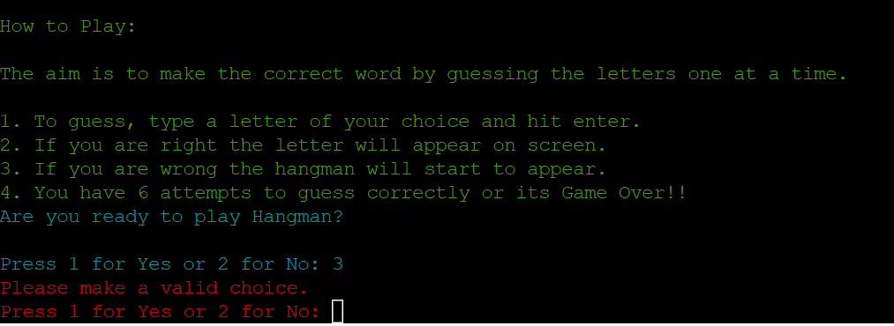 | Pass
Instructions Options | Validate if selection is valid - special character test | 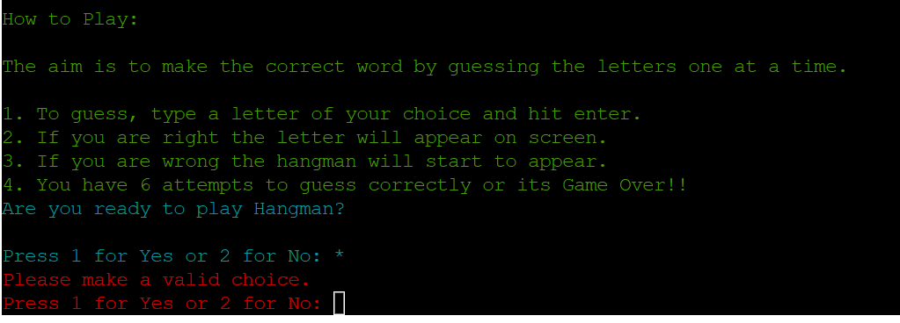 | Pass
Level Selection | Validate if selection is valid - option 1 | 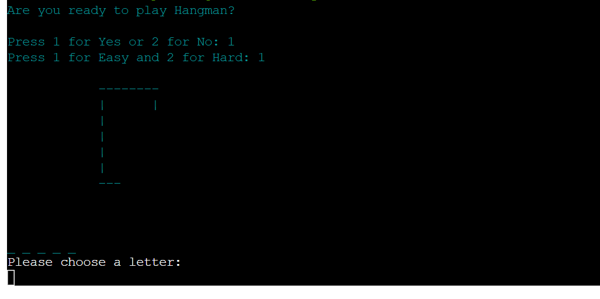 | Pass
Level Selection | Validate if selection is valid - option 2 |  > | Pass
Level Selection | Validate if field is empty | 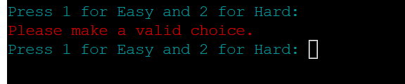 > | Pass
Level Selection | Validate if selection is valid - letter | 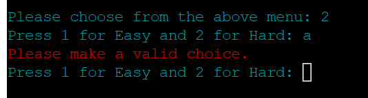 > | Pass
Level Selection | Validate if selection is valid - Number | 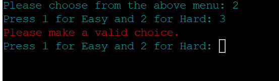 > | Pass
Level Selection | Validate if selection is valid - Special Character | 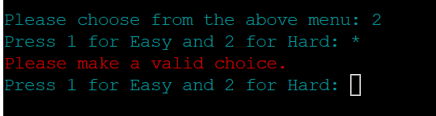 > | Pass
Game Play | Validate if selection is valid - special character test | 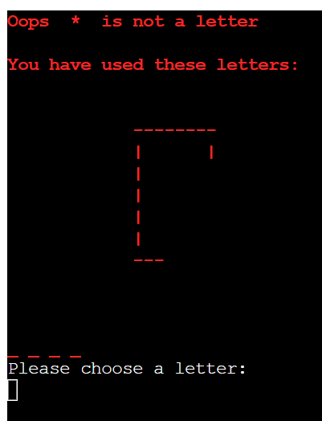 | Pass
Game Play | Validate if selection is valid - Number test | 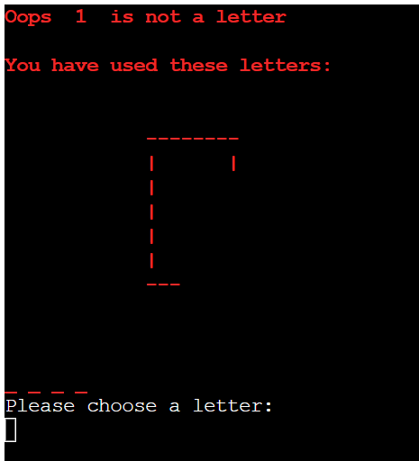 | Pass
Game Play | Validate if field is empty | 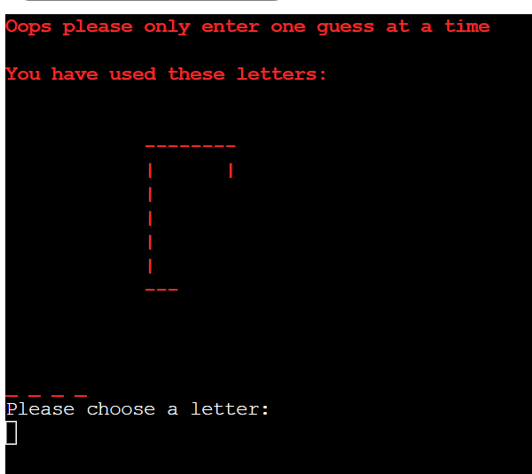 | Pass
Game Play | Validate if selection is valid - Multiple character test | 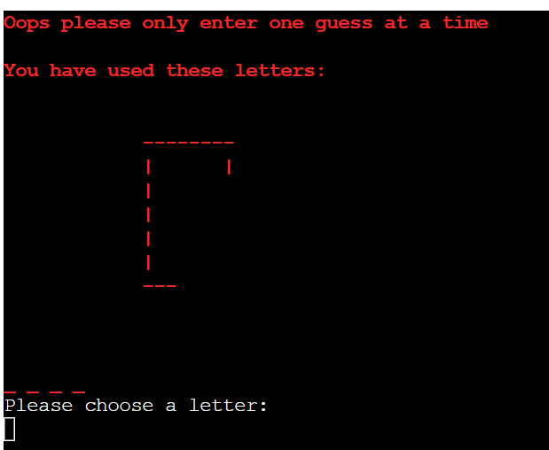 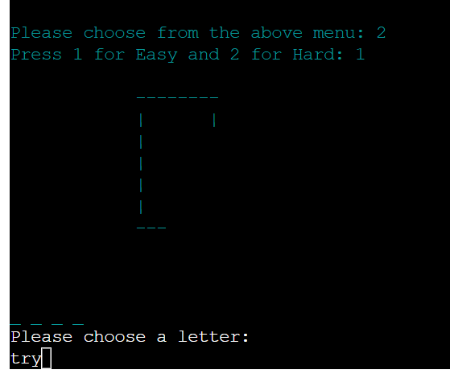 | Pass
Winning Message | Validate if message is correct | 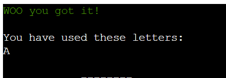 | Pass
Losing Message | Validate if message is correct |  | Pass
Play again input | Validate if selection is valid  - option 1 | 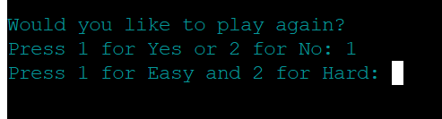 | Pass
Play again input | Validate if selection is valid  - option 2 | 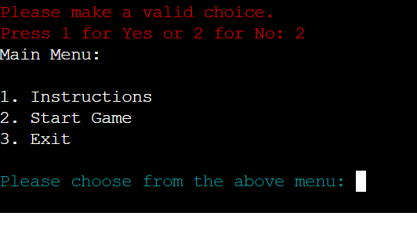 | Pass
Play again input | Validate if selection is valid  - letter | 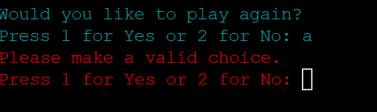 | Pass
Play again input | Validate if selection is valid  - number | 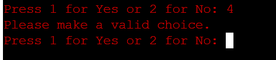 | Pass
Play again input | Validate if selection is valid  - special | 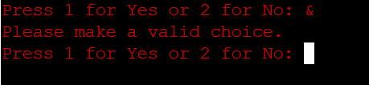 | Pass
Play again input | Validate if field is empty | 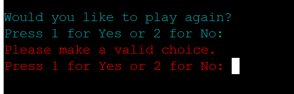| Pass
Exit Game option | Validate if field is empty | 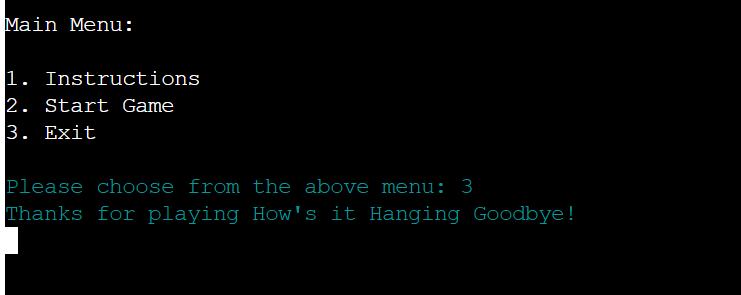 | Pass

<!-- TOC -->
#### User Stories Testing
- As a user I want the game to be easy to navigate.
    - This was achieved by using the numbers 1 and 2 for Yes and No consistently throughout the game. 
- As a user I want the game to loop and allow players to continue playing or exit after each round. 
    - This was achieved by asking player if they want to play again after each win or loss with 1 starting the game again and 2 bringing the user back to the main menu. 
- As a user I want it to be clear how many attempts are left.
    - This was achieved by printing the remaining attempts after each round of the game. 
- As a user I want to give the user a choice of difficulty.
    - This was achieved by providing the user with a choice of easy or hard difficulty levels at the start of each game. 
- To provide the user with an easy to find instructions section to explain how the game works.
    - This was achieved by providing an instructions option on the main menu. 

<!-- TOC -->
#### Validation Testing:
Testing | Results 
| --- | --- | 
Initial validation testing | 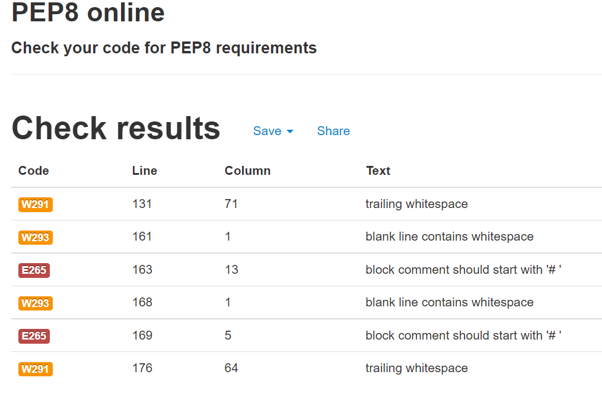  
Final validation testing | 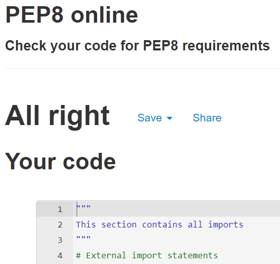 
Words.py validation testing |  

- The code was tested using a PEP8 validator and the initial results were fixed by correcting all of the errors and warnings shown until none remained. 

<!-- TOC -->
#### Bugs:
<!-- TOC -->
##### Fixed Bugs:
Bug | Example |  Description | Fix
| --- | --- | --- | --- | 
Name Entry |  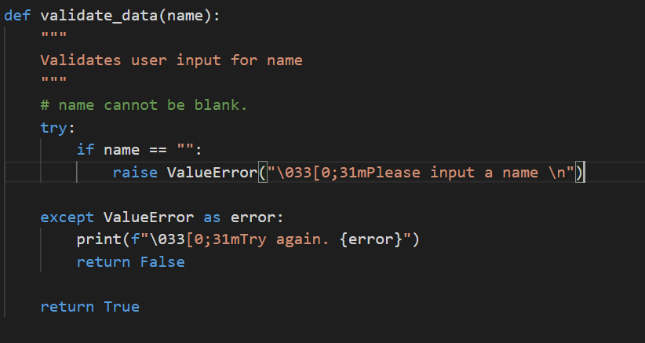 | This bug was noted during testing. The original code allowed for a space to be entered as a Name. However, this was not a valid entry as it does not print a name to the terminal. | This was fixed by adding an elif statement to the code to ensure that a character needs to be entered. 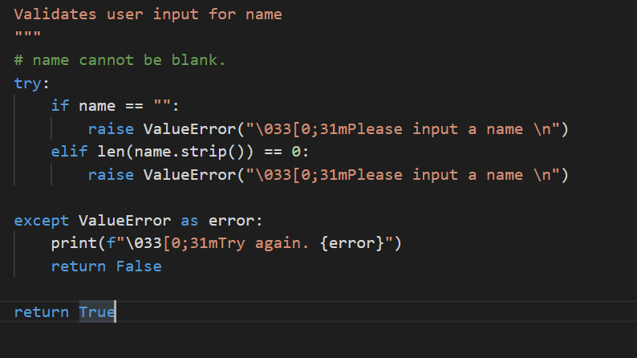
Numbers accepted | 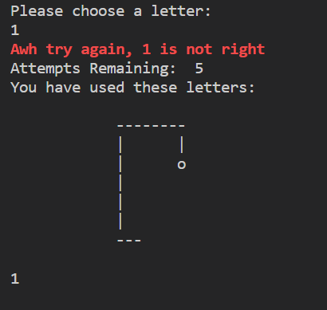 | This bug was noted during testing of the game. It was noted that numbers were accepted as valid guesses by the user. | This bug was fixed by adding the isalpha() method to the elif statement for players_turn. 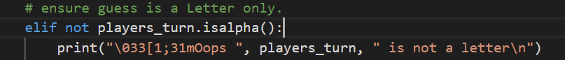
Double Hangman | 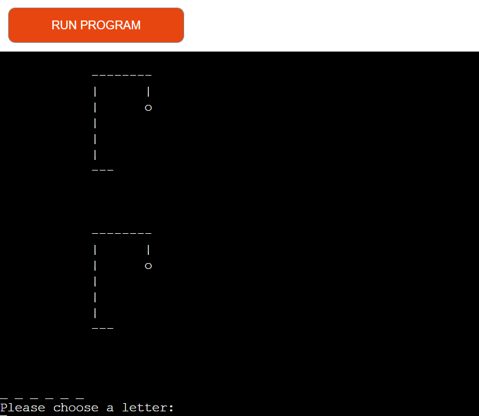 | This bug was observed during game play that if a guess was made two hangman images were printed in error. | This bug was fixed by removing the second print(hangman_status(attempts)) that was present in the code. 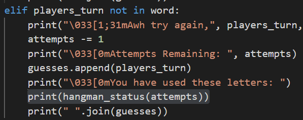

<!-- TOC -->
### Deployment:
The application has been deployed using <a href="">Heroku</a> by following these steps:

Heroku was used to deploy the application.

* Commit changes and push them to GitHub.
* Go to the Heroku's website.
* Create an account or select log in. 
* From the Heroku dashboard, click on "Create new app".
* Enter the "App name" and "Choose a region" before clicking on "Create app".
* Go to "Config Vars" under the "Settings" tab.
* Click on "Reveals Config Vars" and add the KEY: CREDS and the VALUE stored in creds.json file if needed.
* Add the Config Var, KEY: PORT and VALUE: 8000.
* Go to "Buildpacks" section and click "Add buildpack".
* Select "python" and click "Save changes"
* Add "nodejs" buildpack as well using the same process.
* Go to "Deployment method", under the "Deploy" tab select "GitHub" and click on "Connect to GitHub".
* Go to "Connect to GitHub" section and "Search" the repository to be deployed.
* Click "Connect" next the repository name.
* Choose "Automatic deploys" or "Manual deploys" to deploy your application.

<!-- TOC -->
### References:
- The code used to create the images that display the hangman image to the user were adapted from youtube and github user Kiteco. 
- <a href="https://www.w3schools.com/python/ref_string_isalpha.asp">W3Schools </a>was used as a resource for solving syntax errors and for the isalpha() method. 
- <a href="https://www.askpython.com/python/examples/exit-a-python-program">Askpython </a>was used for the implementation of sys.exit()
- <a href="https://stackoverflow.com/">Stack Overflow </a> was used for assistance with troubleshooting issues.
- <a href="https://www.yawintutor.com/indentationerror-expected-an-indented-block-in-python/#:~:text=The%20python%20IndentationError%3A%20expected%20an,mix%20of%20tabs%20and%20spaces">Yawin Tutor </a>was used for fixing syntax and coding errors that appeared throughout the coding process. 

<!-- TOC -->
### Acknowledgements
- First I would like to thank my Partner for his love and support throughout the completion of this project.
- I would also like to thank my mentor Marcel for his advice and support.
- My friends for constantly testing the project.
- Tutor Assistance for their help and support.
- Code Institute and its Slack community for their support and providing me with the necessary knowledge to complete this project.